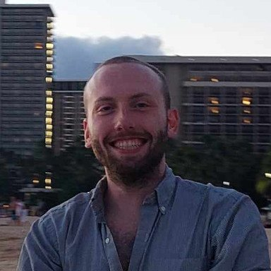
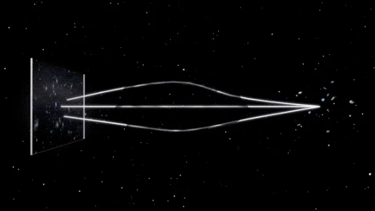

class: middle, center, title-slide

# Inverting scientific images with  diffusion models

AI Action Summit: AI, Science and Society 
February 6, 2025

 

.grid[
.kol-1-3[
.width-60.circle[]
]
.kol-2-3[

 
Gilles Louppe 
[g.louppe@uliege.be](mailto:g.louppe@uliege.be)

]
]

???

Trim back to 15 slides max, to fit in 20 minutes + 5 minutes Q&A.

---
class: middle, black-slide, center
background-image: url(figures/y.png)
background-size: cover

.bold.larger[From a noisy observation $y$...]

---

class: middle, black-slide, center
background-image: url(figures/x.png)
background-size: cover

.bold.larger[... can we recover images $x$?]

---

class: middle, black-slide, center

.larger[

$$
\begin{aligned}
    \dot{u} & = - u \nabla u + \frac{1}{Re} \nabla^2 u - \frac{1}{\rho} \nabla p + f \\\\
    0 & = \nabla \cdot u
\end{aligned}
$$

]

.bold.larger[

... or parameters $\theta = \\\{Re, \rho, f\\\}$?

]

---

class: middle

.width-90[]

## Problem statement

Given a noisy observation $y$, estimate either
- the posterior distribution $p(x|y) \propto p(x) p(y|x)$ of latent states $x$, or
- the posterior distribution $p(\theta|y)$ of parameters $\theta$.

???

Insist on the distributional aspect of the problem, we don't just care about a pretty point estimate, as for image inpainting, but about the full posterior distribution.

---

class: middle

.center.width-10[]

.center[
How to estimate $p(x|y)$, when $x$ is high-dimensional?
]

---

class: middle

## Diffusion models 101

Samples $x \sim p(x)$ are progressively perturbed through a diffusion process described by the forward SDE $$\text{d} x\_t = f\_t x\_t \text{d}t + g\_t \text{d}w\_t,$$
where $x\_t$ is the perturbed sample at time $t$.

.center[
.width-90[]
Forward diffusion process.
]

.footnote[Credits: [Song](https://yang-song.net/blog/2021/score/), 2021.]

---

class: middle

The reverse process satisfies a reverse-time SDE that can be derived analytically from the forward SDE as $$\text{d}x\_t = \left[ f\_t x\_t - g\_t^2 \nabla\_{x\_t} \log p(x\_t) \right] \text{d}t + g\_t \text{d}w\_t.$$

Therefore, to generate data samples $x\_0 \sim p(x\_0) \approx p(x)$, we can draw noise samples $x\_1 \sim p(x\_1) \approx \mathcal{N}(0, \Sigma\_1)$ and gradually remove the noise therein by simulating the reverse SDE from $t=1$ to $0$.

.center[
.width-90[]
Reverse denoising process.
]

.footnote[Credits: [Song](https://yang-song.net/blog/2021/score/), 2021.]

---

class: middle 

.center.width-90[]

The score function $\nabla\_{x\_t} \log p(x\_t)$ is unknown, but can be approximated by a neural network $d\_\theta(x\_t, t)$ by minimizing the denoising score matching objective
$$\mathbb{E}\_{p(x)p(t)p(x\_t|x)} \left[ || d\_\theta(x\_t, t) - x ||^2\_2 \right].$$
The optimal denoiser $d\_\theta$ is the mean $\mathbb{E}[x | x\_t]$ which, via Tweedie's formula, allows to use $$s\_\theta(x\_t, t) = \Sigma\_t^{-1}(d\_\theta(x\_t, t) - x\_t)$$ as a score estimate of $\nabla\_{x\_t} \log p(x\_t)$ in the reverse SDE.

---

class: middle

.center.width-10[]

## Inverting single observations

Using the Bayes' rule, the posterior score $\nabla\_{x\_t} \log p(x\_t|y)$ to inject in the reverse SDE can be decomposed as
$$\nabla\_{x\_t} \log p(x\_t|y) = \nabla\_{x\_t} \log p(x\_t) + \nabla\_{x\_t} \log p(y|x\_t) - \sout{\nabla\_{x\_t} \log p(y)}.$$

This enables .bold[zero-shot posterior sampling] from a diffusion prior $p(x\_0)$ without having to pre-wire the neural denoiser to the observation model $p(y|x)$.

---

class: middle
exclude: true

.center.width-60[]

.center[

Turning a diffusion model trained on ImageNet 512x512 images into a conditional generator using a classifier $p(y|x)$ as observation model.

]

.footnote[Credits: [Dhariwal and Nichol](https://arxiv.org/abs/2105.05233), 2021 (arXiv:2105.05233).]

---

class: middle

.avatars[]

## Approximating $\nabla\_{x\_t} \log p(y | x\_t)$

We want to estimate the score $\nabla\_{x\_t} \log p(y | x\_t)$ of the noise-perturbed likelihood $$p(y | x\_t) = \int p(y | x) p(x | x\_t) \text{d}x.$$

Our approach:
- Assume a linear Gaussian observation model $p(y | x) = \mathcal{N}(y | Ax, \Sigma\_y)$.
- Assume the approximation $p(x | x\_t) \approx \mathcal{N}(x | \mathbb{E}[x | x\_t], \mathbb{V}[x | x\_t])$,  where $\mathbb{E}[x | x\_t]$ is estimated by the denoiser and $\mathbb{V}[x | x\_t]$ is estimated using Tweedie's covariance formula.
- Then $p(y | x\_t) \approx \mathcal{N}(y | A \mathbb{E}[x | x\_t], \Sigma\_y + A \mathbb{V}[x | x\_t] A^T)$.
- The score $\nabla\_{x\_t} \log p(y | x\_t)$ then approximates to 
$$\nabla\_{x\_t} \mathbb{E}[x | x\_t]^T A^T (\Sigma\_y + A \mathbb{V}[x | x\_t] A^T)^{-1} (y - A \mathbb{E}[x | x\_t]).$$

.footnote[See also [Daras et al (2024)](https://giannisdaras.github.io/publications/diffusion_survey.pdf) for a survey on diffusion models for inverse problems.]

--

count: false

.front.width-70.center[]

---

class: middle

.center[
.width-65[]
.width-25[]
]

.center.width-100[]

.center[

Posterior source galaxies $x$ can be recovered from gravitional lenses $y$ by  zero-shot posterior sampling from a diffusion prior $p(x)$ of galaxy images.

]

.footnote[Credits: [Adam et al.](https://arxiv.org/abs/2211.03812), 2022 (arXiv:2211.03812).]

---

class: middle

.center.width-100[]

.center[

Posterior M87 black hole images $x$ using a diffusion prior $p(x)$  based on GRMHD simulations.

]

.footnote[Credits: [Wu et al.](https://arxiv.org/abs/2405.18782), 2024 (arXiv:2405.18782).]

---

class: middle

.avatars[]

## Score-based data assimilation in dynamical systems

.center.width-100[]

The goal of .bold[data assimilation] is to estimate plausible trajectories $x\_{1:L}$ given one or more noisy observations $y$ (or $y\_{1:L})$ as the posterior $$p(x\_{1:L} | y) = \frac{p(y | x\_{1:L})}{p(y)} p(x\_0) \prod\_{i=1}^{L-1} p(x\_{i+1} | x\_i).$$

.footnote[Credits: [Rozet & Louppe](https://arxiv.org/abs/2306.10574), 2023 (arXiv:2306.10574).]

???

Assume the latent state $x$ evolves according to a transition model $p(x\_{i+1} | x\_i)$ and is observed through an observation model $p(y | x\_{1:L})$. (Typically, the observation model will be $p(y\_i | x\_i)$, but we consider the general case here.) 

---

class: middle

.center.width-100[]

Our approach:
- Build a score-based generative model $p(x\_{1:L})$ of arbitrary-length trajectories$^\*$. 
- Use zero-shot posterior sampling to generate plausible trajectories from noisy observations $y$.

.footnote[*:The score of a (noise perturbed) trajectory can be approximated by a sum of scores. See paper for details.]

---

class: middle

.center.width-100[]

.center[Sampling trajectories $x\_{1:L}$ from  noisy, incomplete and coarse-grained observations $y$.]

---

class: middle
count: false

.center.width-100[]

.center[Sampling trajectories $x\_{1:L}$ from  noisy, incomplete and coarse-grained observations $y$.]

---

class: middle

.center.width-75[]

.center[SDA can assimilate noisy weather observations to produce stochastic ensembles.]

.footnote[Credits: [Manshausen et al](https://arxiv.org/abs/2406.16947), 2024.]

---

class: middle

.avatars[]

.center.width-60[]

## Learning priors from noisy observations

Assume only observations $y \sim p(y)$ and a known observation model $p(y | x)$.

The objective of .bold[Empirical Bayes] is find a prior model $q\_\theta(x)$ such that $$q\_\theta(y) = \int p(y | x) q\_\theta(x) \text{d}x$$ is closest to $p(y)$.

---

class: middle

Our approach:
- If we parameterize the latent state $x$ with a diffusion prior $q\_\theta(x)$, then Expectation-Maximization can be used to maximize $q\_\theta(y)$.

- It can be shown that the EM update
$$\theta\_{k+1} = \arg \max\_\theta \mathbb{E}\_{p(y)}\mathbb{E}\_{q\_{\theta\_k}(x|y)} \left[ \log q\_\theta(x) \right],$$
where $q\_{\theta\_k}(x|y)$ is obtained by posterior sampling from $q\_{\theta\_k}(x)$,
leads to a sequence of parameters $\theta\_k$ such that $\mathbb{E}\_{p(y)} \left[ \log q\_{\theta\_k} (y) \right]$ is monotonically increasing and converges to a local optimum.

---

class: middle

.center.width-75[]

.center.width-75[]

.center[
    
Samples from the prior $q\_{\theta\_k}(x)$ (top) and the posterior $q\_{\theta\_k}(x|y)$ (bottom) along the EM iterations when training from corrupted CIFAR-10 images.

]

---

class: middle

.center.width-80[]

.center[Posterior samples for accelerated MRI using a diffusion prior trained only from observations with subsampled frequencies.]

---

class: middle

.center.width-10[]

## Conclusions

- Diffusion models are more than pretty-pictures generators.
- They are a new tool for dealing with high-dimensional inverse problems in science.
- They enable zero-shot posterior sampling, without pre-wiring the network to observations.

---

class: middle
count: false

.avatars[]

References:
- .bold[Score-based data assimilation] François Rozet, Gilles Louppe.  NeurIPS 2023, [arXiv:2306.10574](https://arxiv.org/abs/2306.10574).
- .bold[Score-based Data Assimilation for a Two-Layer Quasi-Geostrophic Model] François Rozet, Gilles Louppe.  ML4PS workshop NeurIPS 2023, [arXiv:2310.01853](https://arxiv.org/abs/2310.01853).
- .bold[Learning Diffusion Priors from Observations by Expectation Maximization] François Rozet, Gérôme Andry, François Lanusse, Gilles Louppe.  NeurIPS 2024, [arXiv:2405.13712](https://arxiv.org/abs/2405.13712).

---

class: middle, center, end-slide
count: false

The end.

